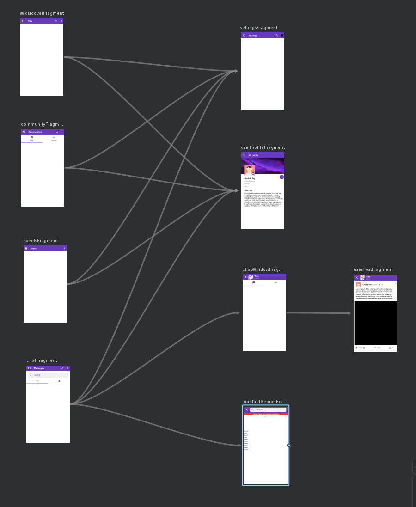
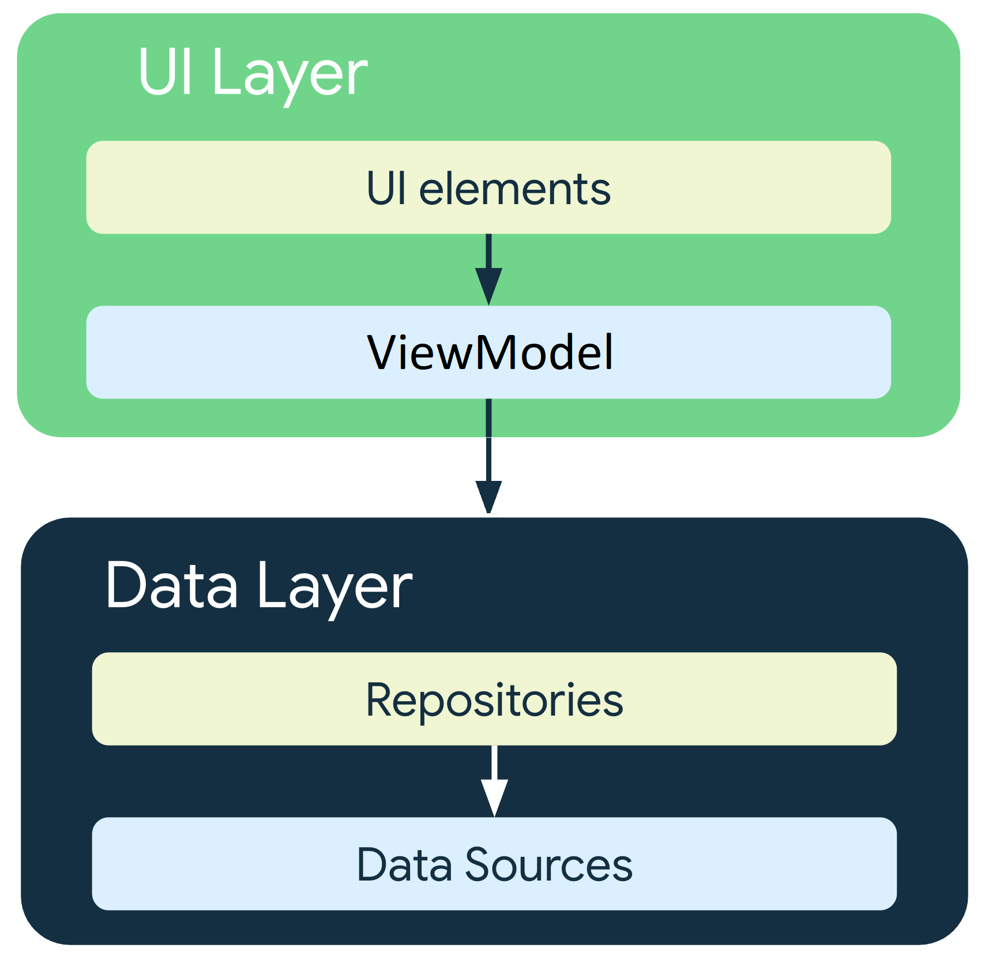

# My Android App
_A Chat app Android project_

This is an Android application I have started a while ago as a side project when I first dived into the Kotlin language.
I have had the most fun diving into Android Apps world with its rich and always up to date documentation, the Android Jetpack library suite, 
and its overwhelmingly helpful and growing community

I have also developed a server API for this App, based on the NodeJS JavaScript runtime and the various libraries it offers.

_See the code base for the [NodeJS-API server](https://github.com/vbounyasit/NodeJS-API)_

_See my [Trello board](https://trello.com/b/0NH0WcIo/android-app) with the technical business rules I implemented_

## App features
The main part of the App is a single activity and multiple fragments type of application. It relies on navigation graphs to handle everything related to screen transitions.

The App is currently made of the following UI screens or components : 
- a **user page screen** allowing new users to **log in or sign up** to the platform
- a **side navigation page** displaying **basic user information** and allowing access to **app and user profile settings**
- an **App settings page** accessible from side navigation
- a **user profile page** allowing users to **view their profile information and edit them**
- a **chat history page** allowing users to **view current conversations and create new ones with others**
- a **chat window** for each conversation displaying **chat bubbles**
- a **group window** for each chat window displaying **user posts, upcoming events and other things**
- a **contact list** page displaying **the user's contacts, outgoing and incoming contact requests**
- a **search bar** allowing users to **search the whole platform for users** by name and **send contact requests to them**
- a **user post page** where other users from the platform can **have a discussion by posting comments**
- a **notification manager** that will send app notifications when **a user receive a new chat message**

A **group page** will automatically be created after initiating a new conversation, where users will be able to **post content and medias**, or **comment on existing posts**. 
They will also be able to **upvote/downvote/share** existing posts or comments

Here's a sneak peak at the navigation graph :

## Architecture choices
The **MVVM (Model-View-ViewModel)** architecture has been used for this project and based on the [Guide to app architecture](https://developer.android.com/topic/architecture#recommended-app-arch) by Google.
It relies on the [separation of concerns principle](https://en.wikipedia.org/wiki/Separation_of_concerns), cutting the application into multiple layers with single main responsibilities :
- The **Data layer** : _contains **Repositories** responsible for retrieving data from different **data sources** (Network API, local database, etc), applying **business logic** to it, and serving it to the **UI layer**_
- The **Domain layer** : _contains all the complex business logic used by the various ViewModels. It is an **optional layer** depending on **how complicated your use cases are**. This project does not contain a domain layer._
- The **UI layer** : _responsible for receiving relevant business data from the **Data layer** and displaying it on screen. It is composed of **Views** where the various UI elements are displayed, and **ViewModels** which hold the data exposed to the UI, and handle its logic._

## Libraries

### General
- [Retrofit](https://square.github.io/retrofit/) is used for the **Network layer**, to allow the App to query and retrieve the relevant data from **the remote API server**
- [Moshi](https://github.com/square/moshi) allows us to parse various **JSON responses** from the remote API, or to serialize and **pass data between various components** in the App
- [Room](https://developer.android.com/jetpack/androidx/releases/room) is a database library used for **persisting data locally** in various structured tables
- [Kotlin coroutines](https://developer.android.com/kotlin/coroutines) allows us to use **Kotlin coroutines** for launching asynchronous work on various threads
- [Glide](https://github.com/bumptech/glide) is an open source media management. It allows us to **load images or other medias efficiently** with intelligent memory and disk caching, with additional features such as image cropping/resizing/etc
- [Hilt](https://developer.android.com/training/dependency-injection/hilt-android) is a **dependency injection** library. It is used to inject various components into the main parts of our App such as Fragments, ViewModels, Activities, etc.
  It allows us to **obtain an available instance** for our local database, network component, DAO, dispatchers or other components without the need to instantiate each of them as Singletons manually which can become **very tedious**
- [WorkManager](https://developer.android.com/topic/libraries/architecture/workmanager) allows us to use Android's WorkManager component, in order to perform various **background tasks** (See [guide to background work](https://developer.android.com/guide/background) for more details)
- [SocketIO](https://socket.io/fr/blog/native-socket-io-and-android/) allows us to open a **Socket connection** between our device and the remote server for **real time executions** such as instant chat messaging, chat/posts/comments notifications, etc

### UI
- [Material Components](https://material.io/develop/android/docs/getting-started) allows the various UI elements of our App to **inherit from a common design system** known as **Material design**, created by Google
- [Navigation](https://developer.android.com/guide/navigation/navigation-getting-started) allows us to use the Navigation component to navigate between different destination fragments

### Testing
- [MockK](https://mockk.io/) allows us to generate mock instances of various Application components that would otherwise be difficult to instantiate for **unit tests**
- [KoTest](https://kotest.io/) is a flexible multi-platform **assertion Framework** allowing us to write simple, clean and elegant test cases
- [JUnit](https://kotlinlang.org/docs/jvm-test-using-junit.html) is a popular **unit testing Framework**

**Under construction...**
